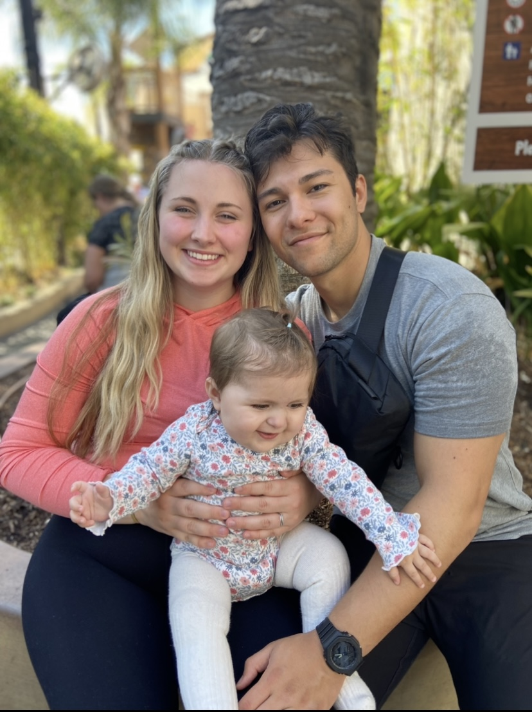

## Wk 1: Career Prep: Getting the Word out

**Name**: Mosiah Valdez-Bates

**Background**: I am a husband and father, I was originally interested in biomedical science and pursuing some thing in the medical field but after a semester, and a half, I realized I wasn't as interested in the subject as I originally had thought. After taking a couple of intro to programming courses, I really enjoyed the material and the homework and fell in love with the potential job opportunities.

**Home**: Owosso, Michigan 

**Interests**: I love spending time with my family, they are my world, with them we enjoy camping and long car drives. In my free time, I also enjoy flying drones, and working on a variety of software/hardware projects.

**Unique**: As a young man, I was a Boy Scout and took to heart the motto always be prepared, If you are in need of some thing, I almost always have something that can solve your problem either on me or in my car. My family knows me as the person who has a Mary Poppins bag you ask for something and it magically appears.

**Photo**: 

This is me and my family at Universal studios during my summer break. It was a lot of fun and our daughter loved the different characters walking around!

**Resume**: 
[https://github.com/mosiahvb/cse-397/blob/main/resume.pdf]

**Cover Letter**:
[]

**LinkedIn**: 
[https://www.linkedin.com/in/mosiahvaldez-84588a1a5/]
